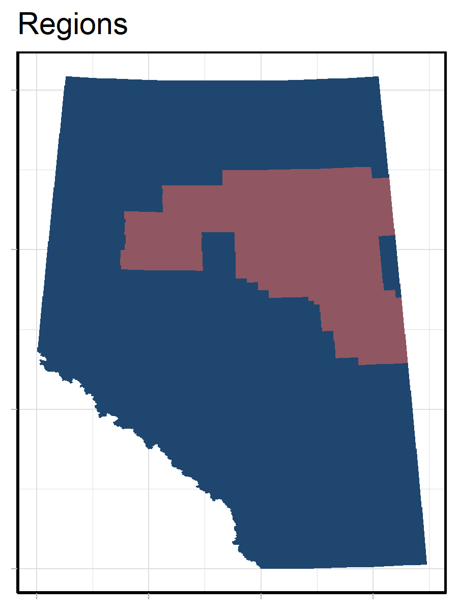

# Methods

## Maximum Abundance Threshold
To determine if a species should be reported on in a focal region, we calculate the mean abundance of the species and compare it to 1% of the maximum provincial abundance.

$mean(RegionalAbundance) > [max(ProvincialAbundance) * 0.01]$

If the species is predicted to occur in the region under either current or reference conditions, we include it in our summary. This approach can be applied to all regions, irrespective of region size, and identifies areas where the species is "reasonably" abundant. However, we have identified situations where this approach either includes or excludes species from a region that differs from expert opinion. Some of the reasons that this occurs are:

- If we have outlier predictions, the maximum abundance may become so large that mean abundance is unlikely to ever be greater than the defined threshold.

- If a species has a high probability of occurrence within a small portion of a large focal region, the mean abundance may be higher than the defined threshold. This species would occur in the region, but is of low relevance for management and reporting purposes.

## Ratio Threshold

One alternative approach is to filter species by comparing the mean abundance within the focal region to the mean abundance across the province.. 

$mean(RegionalAbundance) > mean(ProvincialAbundance)$

If the species is predicted to occur in the region under either current or reference conditions, we include it in our summary.  This approach can be applied to all regions, irrespective of region size, and identifies areas where the mean abundance for the species within the focal region is greater than or equal to the mean abundance across the province. However, this thresholding approach is likely to be highly restrictive. Therefore, we explored adjusting the provincial mean abundance by different modifiers (100%, 75%, 50%, 25%).

$mean(RegionalAbundance) > [mean(ProvincialAbundance) * 1]$
$mean(RegionalAbundance) > [mean(ProvincialAbundance) * 0.75]$
$mean(RegionalAbundance) > [mean(ProvincialAbundance) * 0.5]$
$mean(RegionalAbundance) > [mean(ProvincialAbundance) * 0.25]$

In both methods, we ignore pixels that do not have predictions within the reporting region due to many species not having full provincial models.

## Method Comparison

As the ABMI is constantly reporting on new regions of interest, we assessed the utility of these methods using simulated regions of different spatial sizes (25 km^2, 100 km^2, 1000 km2, 10,000 km^2, 100,000 km^2). In some instances, simulated regions did not result in complete spatial coverage. These missing areas are represented using white or grey.

In addition, we determined the species list for the Oilsands Monitoring Region (Figure 1) based on each filtering approach. By using an area of the province we consistently report on, we can determine which filtering approach best matches our expert opinions.

We ran this analysis using the bird, mammal, and vascular plant coefficients (version 2022) and the 2018 Human Footprint Inventory. These taxonomic groups were chosen as we have a good ecological understanding for how these species are spatially distributed across Alberta. Due to the number of species evaluated, we are only presenting a subset of results in this document. ABMI staff can access the full set of results by contacting the maintainer of this repository.

{width=80%}

